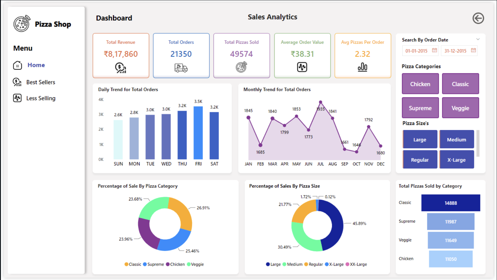

# Sales Analysis | SQL & Power BI

## Project Overview
An end-to-end data analytics project designed to extract, transform, and visualize pizza sales data. This project leverages SQL Server for robust data processing and Power BI to deliver an interactive executive dashboard, providing actionable insights to optimize operations, menu offerings, and overall revenue.

## Dashboard 

## Tech Stack
* **Database & ETL:** SQL Server, SQL Server Integration Services (SSIS)
* **Data Visualization & Modeling:** Power BI, Power Query
* **Languages:** SQL, DAX

## Technical Implementation
* **Data Pipeline:** Utilized SQL Server and SSIS to manage the ETL process, ensuring clean and structured data for analysis.
* **Metric Calculation:** Wrote custom SQL queries to aggregate data and calculate core business Key Performance Indicators (KPIs), such as Total Revenue, Average Order Value (AOV), and distinct order counts.
* **Data Visualization:** Built an interactive Power BI dashboard by connecting Power Query directly to the SQL database, enabling dynamic filtering by date, pizza category, and size.

## Dataset Overview
The dataset follows a star schema model with a central churn fact table and supporting dimension tables. Key attributes include:
* **Customer demographics:** Age and gender.
* **Financial indicators:** Credit score and balance.
* **Behavioral indicators:** Active status and credit card ownership.
* **Regional attributes:** Geography.
* **Time intelligence:** Date dimension.

---

## Key Business Questions Answered

### 1. What is the overall churn rate?
Out of 10,000 customers, 2,037 customers exited, resulting in a churn rate of approximately **20%**. This indicates significant revenue risk and highlights the need for proactive retention strategies.

### 2. Which customer segments contribute most to churn?
Customers with Fair and Poor credit scores contribute the highest churn volume. This suggests dissatisfaction among financially constrained customers, potentially due to higher fees, lower approval rates, or limited benefits.

### 3. Does credit card ownership influence churn behavior?
Credit card holders account for nearly **70%** of churned customers. Since credit card users form a large portion of the customer base, retention programs should prioritize improving engagement and perceived value in this segment.

### 4. Are there gender-based differences in churn?
Female customers represent approximately **56%** of total churn volume. This indicates a potential gap in product personalization, service experience, or communication strategy.

### 5. Which geographies show higher churn risk?
Germany shows the highest churn ratio relative to retained customers, while France demonstrates stronger retention performance. This suggests regional differences in competitive pressure, pricing perception, or service quality.

### 6. Which age groups are most likely to churn?
Churn peaks in the mid-career age group around **40 to 50 years**. Customers in this stage often reassess financial products such as mortgages, investments, and wealth services, increasing switching probability.

### 7. How does churn vary over time?
Churn percentage fluctuates between **18% and 27%** across different months and years. This variability indicates inconsistent retention performance and possible seasonality linked to billing cycles, promotional expiries, or macroeconomic factors.

---

## Business Impact
This analysis helps business teams:
* Prioritize retention investment toward high-risk segments.
* Design geography-specific engagement strategies.
* Improve credit product positioning for vulnerable customers.
* Develop lifecycle-based offerings for mid-career customers.
* Monitor churn trends proactively instead of reactively.

## Recommendations
* Launch targeted retention campaigns for mid-credit score customers.
* Improve customer experience in high-churn regions.
* Introduce personalized financial bundles for mid-age segments.
* Analyze fee structures and benefit perception for credit card users.
* Implement churn prediction models for proactive intervention.
